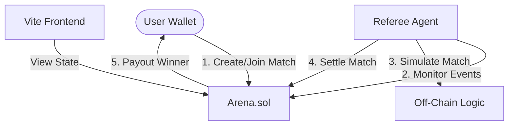

# The Arbiter: Decentralized Wagering & Automated Settlement

**The Arbiter** is the execution layer for trustless competitive gaming — an autonomous AI referee enabling high-speed competition, secure wagering, and verifiable settlement to unlock scalable wagering economies on Monad.

---

## System Architecture

The following diagram illustrates the interaction between the three core components:



---

## Project Structure

| Component | Technology | Description |
| :--- | :--- | :--- |
| **`contracts/`** | Solidity & Foundry | Core logic, staking, match lifecycle, and fee management. |
| **`agent/`** | Python & Web3.py | Automated node that monitors matches, simulates outcomes, and triggers settlements. |
| **`frontend/`** | React, Vite, Wagmi | Premium UI with wallet integration (RainbowKit) and real-time match tracking. |

---

## Quick Start

### 1. Smart Contracts (`/contracts`)
Install Foundry and deploy the contracts:
```bash
cd contracts
forge install
forge build
# Run tests
forge test
```

### 2. Referee Agent (`/agent`)
The agent requires a Python environment and a funded "Referee" wallet:
```bash
cd agent
python3 -m venv venv
source venv/bin/activate
pip install -r requirements.txt
python referee.py
```
*Note: The agent uses SQLite for persistence and exposes a health check at `localhost:8080/health`.*

### 3. Frontend UI (`/frontend`)
High-performance React app with dynamic pulsed animations and real-time data:
```bash
cd frontend
npm install
npm run dev
```

---

## Environment Variables

Each component requires specific configuration. Examples are provided in their respective `.env.example` files.

### Global Configuration
- **Monad RPC**: `https://testnet-rpc.monad.xyz`
- **Chain ID**: `10143`

---

## Deployed Contracts (Monad Testnet)

- **Arena**: [0xAf4E58b7E9b6F95697E454224825a4539AD08991](https://testnet.monadvision.com/address/0xAf4E58b7E9b6F95697E454224825a4539AD08991)
- **Profiles**: [0xD2d17E03E4F0EaeAfAdB542869258dF0d428C800](https://testnet.monadvision.com/address/0xD2d17E03E4F0EaeAfAdB542869258dF0d428C800)

---

## Features

- **Decentralized Escrow**: Smart contracts hold stakes securely until the referee settles the match.
- **Agent Persistence**: The referee agent uses SQLite to track blocks and settled matches, ensuring zero downtime recovery.
- **Robust Gas Management**: Automated transaction retries and adaptive gas pricing for the Monad ecosystem.
- **Premium User Experience**: Wallet-ready frontend with "Safe-Loading" address normalization to prevent checksum crashes.

## Workflows

This repository includes custom agentic workflows for deployment and verification:
- `/deploy-monad`: Automated deployment script for Foundry.
- `/verify-monad`: Contract verification workflow for Monad Explorer/Sourcify.

---
## Built with ❤️ on Monad
**Michael Dean Oyewole**

---

## License
MIT License. 
